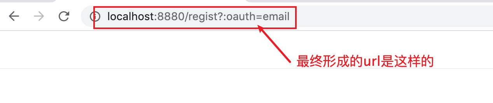
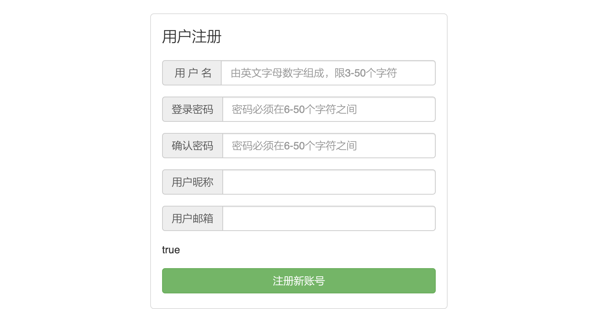

### 获取注册页面


 注册页面被嵌入在header页面上。

如下图，通过beego的模版语法`{{template "static目录下的html文件"}}`在每一个页面中都导入head.html


查看header.html详情：

 

思路和上面的方式一致： 

1. 首先是借助a标签发送get请求，a 标签顺带着还能实现页面的跳转。

2. 然后通过urlfor将get请求转发到AccountController中的Regist方法上。

他这种写法的话，最终形成的url是长成这个样子：

```html
<a herf="{{urlfor "AccountController.Regist" ":oauth" "email" ></a>"}}"></a>
```

> :开头的是他的key，后面紧跟着的是他的值



问：那我不用冒号开头可以不？

也是可以的，这一步主要是进行页面的跳转，而通过/regist就能找到唯一对应的controller实现页面的跳转


request相关的更多参数参考链接

https://gowalker.org/net/http#Request


beego通过下面router中的定义，拼接出和后端controller对应的请求路径


继续跟进beego后端controller部分，可以看到后台返回给前端注册页面：


通过Beego的解析，我们跳转到 views/account/bind.html中。

也就是注册页面




