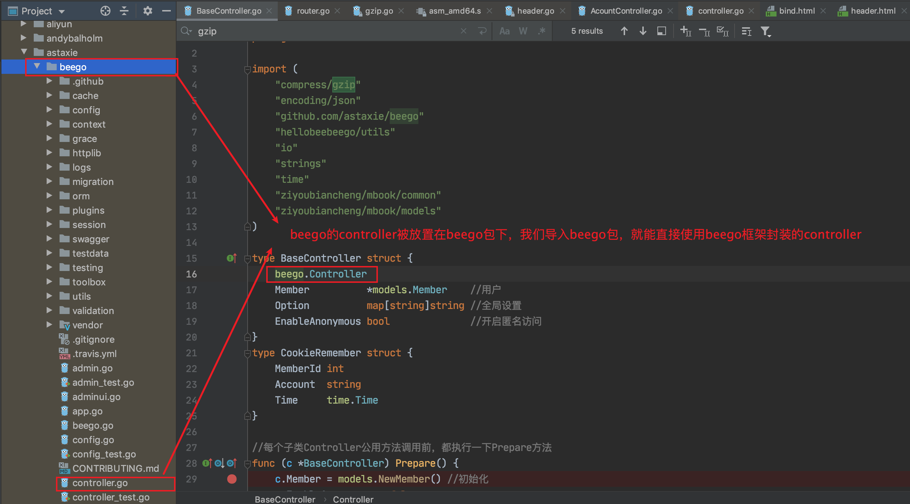
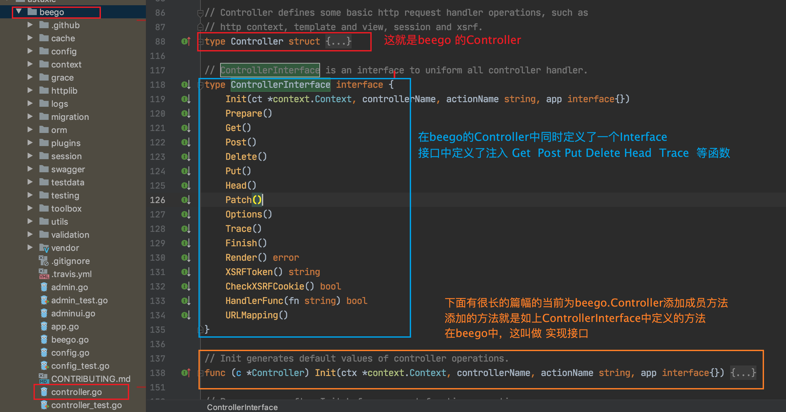
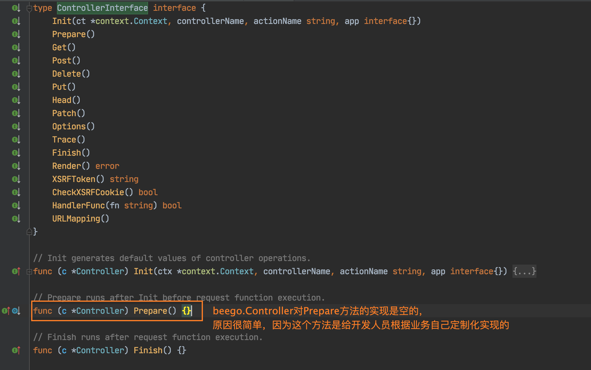

### beego.Controller

再就是说一下关于Beego的Controller如何设计。

作为mvc设计架构的beego，他肯定了有自己的controller



作为开发者，我们需要的是基于beego的controller去开发自己的controller，那么如何基于beego 的controller开发自己的呢？ 其实就是struct的继承。再在beego.Controller中添加上自己的属性。

```go
type BaseController struct{
  beego.Controller
  Member *model.Member // 用户信息
  Option map[string]string
  EnableAnonymous bool // 是否开启匿名访问
}
```

beego.Controller为我们做了什么事呢？看下图




### Prepare()方法

其中有一个方法叫做`Prepare()`

**其实可以这样理解这个prepare（）方法，他的作用和JavaWeb中的拦截器，或者是过滤器的作用相似。**

这个方法的特点，在任何请求从router 进入到 controller中前，都会被回调调用 。



在项目中，于BaseController中实现了Prepare方法，我们去看下他的实现:

> Prepare方法是beego.Controller 从ControllerInterface中继承下来的，但是是空的实现，我们的BaseController又继承了beego.Controller,自然可以重写Prepare方法。

BaseController是着呢定义的

```go
type BaseController struct {
	beego.Controller
	Member          *models.Member    //用户
	Option          map[string]string //全局设置
	EnableAnonymous bool              //开启匿名访问
}
```

既然Prepare方法在任何进入Controller的请求之间都会被调用，那么我们完全可以在里面做一些用户信息合法性的检查：

```go
// 这里的c， 就相当于this对象
func (c *BaseController)Prepare(){
  // Member是项目对用户信息封装的结构体
  // NewMember返回的是结构题指针
  c.Member = models.NewMember();
  // 这个是否开启匿名访问其实只是个标记，给后续的业务使用
  c.EnableAnonymous = false
  // 尝试从Session或者是Cookie中获取到用户的信息，保存在BaseController中
  // 因为其他的Controller都是在使用这和BaseController
  // 这实际上就是实现了对用户信息的抽取，统一保存在的BaseController
  // getSession是beego.Controller的方法，因为继承的关系，所以BaseController也可以使用
  // 获尝试根据key，从session中获取到用的信息，强转成model.Member
  if member,ok:=c.getSession(common.SessionName).(models.Member);ok&&member.MemberId>0{
    	c.Member = member
  }else{
    // 尝试从Cookie中获取登陆信息
    if cookie,ok:=c.GetSecureCookie(common.Appkey(),"login");ok{
      var cookieRemeber CookieRemeber
      // 解析cookie，序列化进cookieRemeber
      err:=utils.Decode(cookie,&cookieRemeber)
      if err ==nil{
        member ,err := models.NewMember().Find(cookieRemeber.MemberId)
        if err == nil{
          //  同样是将member信息储存起来
          c.SetMember(*member)
          c.Member = member
          
        }
      }
    }
  }
}
```

> 当然上面尝试获取的session和cookie本质上都是我们在登陆系统时，添加进上下文的。


