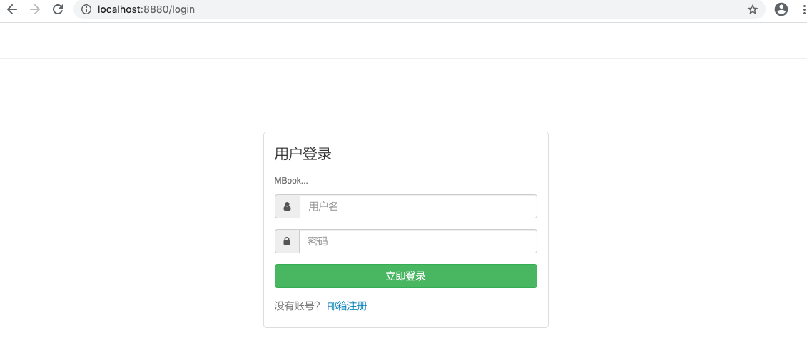

### 获取登陆页面

如下图：



发送 /login请求，向后端请求登陆页面

在路由中添加如下多映射：

beego.Router("/login",&controllers.AccountController{},"*:Login")

在controller中进一步控制登陆动作：

代码如下：

```go
func (c *AccountController) Login() {
	var remember CookieRemember
	//验证cookie
	if cookie, ok := c.GetSecureCookie(common.AppKey(), "login"); ok {
		if err := utils.Decode(cookie, &remember); err == nil {
			if err = c.login(remember.MemberId); err == nil {
				c.Redirect(beego.URLFor("HomeController.Index"), 302)
				return
			}
		}
	}
	c.TplName = "account/login.html"

	if c.Ctx.Input.IsPost() {
		account := c.GetString("account")
		password := c.GetString("password")
		member, err := models.NewMember().Login(account, password)
		fmt.Println(err)
		if err != nil {
			c.JsonResult(1, "登录失败", nil)
		}
		member.LastLoginTime = time.Now()
		member.Update()
		c.SetMember(*member)
		remember.MemberId = member.MemberId
		remember.Account = member.Account
		remember.Time = time.Now()
		v, err := utils.Encode(remember)
		if err == nil {
			c.SetSecureCookie(common.AppKey(), "login", v, 24*3600*365)
		}
		/*	result := make(map[string]interface{})
			result["errcode"] = 0
			result["message"] = "ok"
			c.Data["json"] = result
			c.ServeJSON()*/
		c.JsonResult(0, "ok")
	}

	c.Data["RandomStr"] = time.Now().Unix()
}
```

设计的技巧：将返回登陆页面和执行登陆这个动作的函数二合一了

逻辑如下：

* 登陆成功后为了标示用户的身份信息，做如下两件事
  * 往浏览器中写入cookie
  * 在服务端保存session
* 所以当来到这个方法时，先尝试从cookie中解析出用的信息，如果存在合法的cookie，取出cookie中的用户信息，调用相关的函数帮用户完成登陆
* 如果cookie中没有的话，继续往下执行，查看当前方法是否时post类型的方法，如果是的话


### 发送登陆请求

在前端，提交用于登陆的form表单采用了异步方式：思路如下：

* 通过ajax一步提交表单
  * 成功了使用layerUI友好提示，使用window.location="/" 跳转到主页
  * 失败了使用layerUI友好提示，不跳转。


ajax详细信息如下：

```js
        $("#btn-login").on('click',function () {
            var $btn = $(this).button('loading');

            var account = $.trim($("#account").val());
            var password = $.trim($("#password").val());
            var code = $("[name=captcha]").val();
            if(account === ""){
                layer.msg("账号不能为空");
                $btn.button('reset');
                return false;
            }else if(password === ""){
                layer.msg("密码不能为空");
                $btn.button('reset');
                return false;
            }else if(code !== undefined && code === ""){
                layer.msg("验证码不能为空");
                $btn.button('reset');
                return false;
            }else{
                $.ajax({
                  	// 请求路径通过urlfor构建
                    url : "{{urlfor "AccountController.Login"}}",
                  	// 请求参数，通过jquery选中form表单，然后序列化
                    data : $("form").serializeArray(),
                    dataType : "json",
                    type : "POST",
                    success : function (res) {
                        if(res.errcode !== 0){
                            $("[name=captcha]").val('');
                            layer.msg(res.message);
                            $btn.button('reset');
                            $(".captcha img").trigger("click");
                        }else{
                            window.location = "/";
                        }
                    },
                    error :function () {
                        $("#captcha-img").click();
                        $("#code").val('');
                        layer.msg('系统错误');
                        $btn.button('reset');
                    }
                });
            }
            return false;
        });
    });
```


然后我们其实会面临如下几个问题：

1. **问：正常登陆后页面会跳转，问如何在跳转到登陆页面后直接回显用户的信息呢？**

   看后端的代码实现逻辑的话：这样解决的：

   * 首先会拦截所有的用户请求，看看这个请求中有没有携带cookie，因为从这个cookie中可以解析进一步地得到用户的身份信息。
   * 登陆成功后肯定要往前端浏览器中写入cookie，在后端写入session。

   那这样一来，用进入到主页后，浏览器中本身就有cookie，这样在后端自然就能获取到用户的身份信息。
   
2. **问：当前端使用 window.location = "/" 时，向后端发送请求了吗？**

   是的，会发送path为 “/” 的请求

3. **问：prepare()方法中做了哪些校验的工作？**

   主要的如下：

   设计的思路和作用：

   1. 假设用户已经登陆了，那么后端一定会存在一个session，里面存放着用户的信息。那在这里就可以校验一下，从session中解析出用户的信息
   2. 假设用户的浏览器中有后端发送给他的cookie，但是我们把后端的session文件给删除了，那用户再来请求时，我们肯定不能从sesion中获取出用户的信息了，但是用户浏览器有合法的cookie我们也没有必要让用户重新取登陆，所以在else中，我们解析cookie，手动去mysql中查询用户的信息。

   ```go
   func (c *BaseController) Prepare(){
     // 实例化用户对象
     c.Member = m,
     // 尝试从session和cookie中获取到用户信息，回显给前端，让前端保持用户信息的回显状态
     if member,ok := c.GetSession(common.SessionName).(models.Member);ok && member.MemberId>0{
       c.Member = &member
     }else {
       if cookie,ok := c.GetSecureCookie(common.Appkey(),"login");ok{
         var remember CookieRemeber
         // 将cookie中的信息转换到remember中
         err := utils.Decode(cookie,&remember)
         if err == nil {
           // 从数据库中将用户的信息查询出来
           member，err := models.NewMember().Find()
           c.SetMember(*member)
         }
       }
     }
   }
   ```


1. **问：登陆成功后如果向前端浏览器写入cookie？**
2. **问：登陆成功后如何向后端写入session？**
3. **问：登陆成功后如果返回给前端json串？**

这三个问题的答案都在`Login()`方法中,  理解我就写在代码的注释中

```go
//登录
func (c *AccountController) Login() {
	var remember CookieRemember
	//验证cookie
	if cookie, ok := c.GetSecureCookie(common.AppKey(), "login"); ok {
		if err := utils.Decode(cookie, &remember); err == nil {
			if err = c.login(remember.MemberId); err == nil {
				c.Redirect(beego.URLFor("HomeController.Index"), 302)
				return
			}
		}
	}
	c.TplName = "account/login.html"

	if c.Ctx.Input.IsPost() {
		account := c.GetString("account")
		password := c.GetString("password")
    // 模拟登陆，目的是从mysql中获取出用户的信息
		member, err := models.NewMember().Login(account, password)
		fmt.Println(err)
		if err != nil {
			c.JsonResult(1, "登录失败", nil)
		}
    // 修改最后一次登陆的时间
		member.LastLoginTime = time.Now()
    // 更新数据库中用户信息
		member.Update()
    // 将用户的信息存储进session中
    // 这个SetMember其实是我们自定义的方法
    /*
    	// 设置登录用户信息
			func (c *BaseController) SetMember(member models.Member) {
					if member.MemberId <= 0 {
						c.DelSession(common.SessionName)
						c.DelSession("uid")
						c.DestroySession()
					} else {
						c.SetSession(common.SessionName, member)
						c.SetSession("uid", member.MemberId)
					}
			}
    */
		c.SetMember(*member)
    
    // 从member中取出 id，account，time三个属性构建cookie信息
		remember.MemberId = member.MemberId
		remember.Account = member.Account
		remember.Time = time.Now()
    // 通过工具类，将cookie对象remember进行编码处理，原因是cookie中存储了用户的信息
    // 且会在浏览器中以明文的方式展示，很不安全，故加密处理
    // 具体的实现由 "encoding/gob" 完成
		v, err := utils.Encode(remember)
		if err == nil {
      // 往前端写入cookie
      // 底层执行写入的代码如下：
      // output.Context.ResponseWriter.Header().Add("Set-Cookie", b.String())
      // 方法的由来： c是我们当前的controller， 而当前controller继承了beego的controller
      // 						所以我们可以直接使用这个方法
      // 三个参数：1: 用于加密的盐值。 2: cookie的key。 3: cookie的value
			c.SetSecureCookie(common.AppKey(), "login", v, 24*3600*365)
		}
    
    // 往前端返回json串，自定的方法
		c.JsonResult(0, "ok")
	}

	c.Data["RandomStr"] = time.Now().Unix()
}

```

往前端写入json信息的封装方法

```go
// Ajax接口返回Json
func (c *BaseController) JsonResult(errCode int, errMsg string, data ...interface{}) {
	// 构建返回给前端的对象
	jsonData := make(map[string]interface{}, 3)
	jsonData["errcode"] = errCode
	jsonData["message"] = errMsg

	if len(data) > 0 && data[0] != nil {
		jsonData["data"] = data[0]
	}
	// 这里做序列化的目的是：下面的代码往前端write时需要write字节信息，而Marshal可以实现从对象到字节数据的转换
	returnJSON, err := json.Marshal(jsonData)
	if err != nil {
		beego.Error(err)
	}
	// 设置响应头
	c.Ctx.ResponseWriter.Header().Set("Content-Type", "application/json; charset=utf-8")
	//启用gzip压缩
	if strings.Contains(strings.ToLower(c.Ctx.Request.Header.Get("Accept-Encoding")), "gzip") {
		c.Ctx.ResponseWriter.Header().Set("Content-Encoding", "gzip")
		// 基于beego的ResposeWriter，构建一个可以压缩是write
		w := gzip.NewWriter(c.Ctx.ResponseWriter)
		defer w.Close()
		w.Write(returnJSON)
		w.Flush()
	} else {
		// c.Ctx.ResponseWriter.Write(returnJSON) // 只能write bytes
		// c.Ctx.Output.JSON() 也可以实现往前端输入json串
		 io.WriteString(c.Ctx.ResponseWriter, string(returnJSON))
	}
	c.StopRun()
}

```


其实可以向下面这样简单粗暴的向前端返回json

```go
c.Data["json"] = obj
c.ServeJson()

// 进入ServeJson查看方法的详情，如下，他是默认从 c.Data["json"]中往外取值
func (c *Controller) ServeJSONP() {
	hasIndent := BConfig.RunMode != PROD
	c.Ctx.Output.JSONP(c.Data["jsonp"], hasIndent)
}
```


session相关的补充：

1. 如何开启seesion？开启了session的什么模式？

   

   在conf/app.conf通过配置完成session的开启，

   可以设置session的name，选用什么的privider创建session，已经将sesson存放在哪里

2. 更过session相关：查看文档：https://beego.me/docs/mvc/controller/session.md


