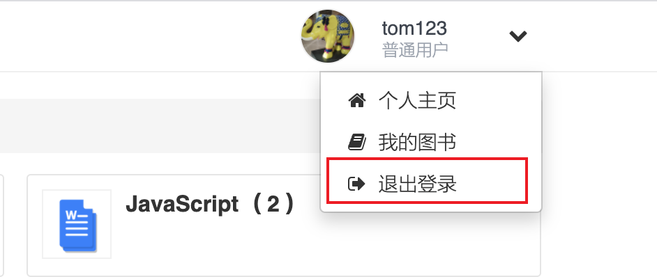

### 登出相关逻辑

登出的请求从浏览器上点击链接发出




前端相关代码：

```html
       <li>
           <a href="{{urlfor "AccountController.Logout"}}" title="退出登录">
             <i class="fa fa-sign-out"></i>
             退出登录
           </a>
       </li>
```

通过urlfor往指定的controller中的指定方法发送请求。模版会自动生成相关的url

后端代码：

```go
func (c *AccountController) Logout() {
  // 删除服务端的session
	c.SetMember(models.Member{})
  // 将浏览器端端cookie过期掉
	c.SetSecureCookie(common.AppKey(), "login", "", -3600)
  // 发起重定向的请求
	c.Redirect(beego.URLFor("AccountController.Login"), 302)
}


// 设置登录用户信息
func (c *BaseController) SetMember(member models.Member) {
	if member.MemberId <= 0 {
		c.DelSession(common.SessionName)
		c.DelSession("uid")
		c.DestroySession()
	} else {
		c.SetSession(common.SessionName, member)
		c.SetSession("uid", member.MemberId)
	}
}
```

上面代码中DelSession设计思路：在底层使用的是beego为我们封装的操作session信息相关的封装类。

```go
// DelSession removes value from session.
func (c *Controller) DelSession(name interface{}) {
	if c.CruSession == nil {
		c.StartSession()
	}
	c.CruSession.Delete(name)
}

```

也就是说，假设我们的项目不是前后端分离的项目，那么我们完全可以将beego的Seesion相关的逻辑和Controller之间绑定，并且，这部分代码是可以复用的代码。


清空cookie这部分代码也是可以和controller唯一绑定的。

```go
func (c *Controller) SetSecureCookie(Secrect,name,value string,others ...interface{}){
		c.Ctx.SetSecureCookie(Secrect,name,value,others)
}
```

清除完上面的信息后，进行重定向的操作：

```go
c.Redirect(beego.URLFor("AccountController.Login"),302)

beego.URLFor()， 可以根据controller中的信息生成string类型的url

302: 表示重定向，同样是用来实现后端告诉浏览器跳转页面, 浏览器中的url会发生改变。
301: 永久性的重定向
```


### 注册相关逻辑


