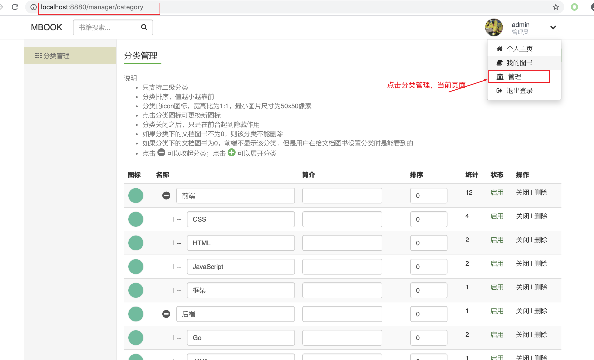
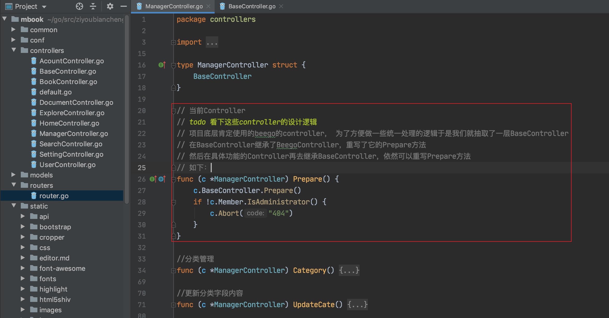
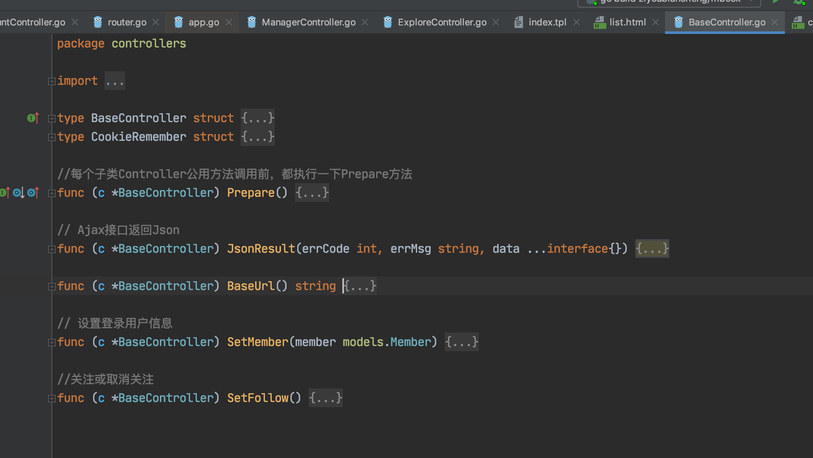
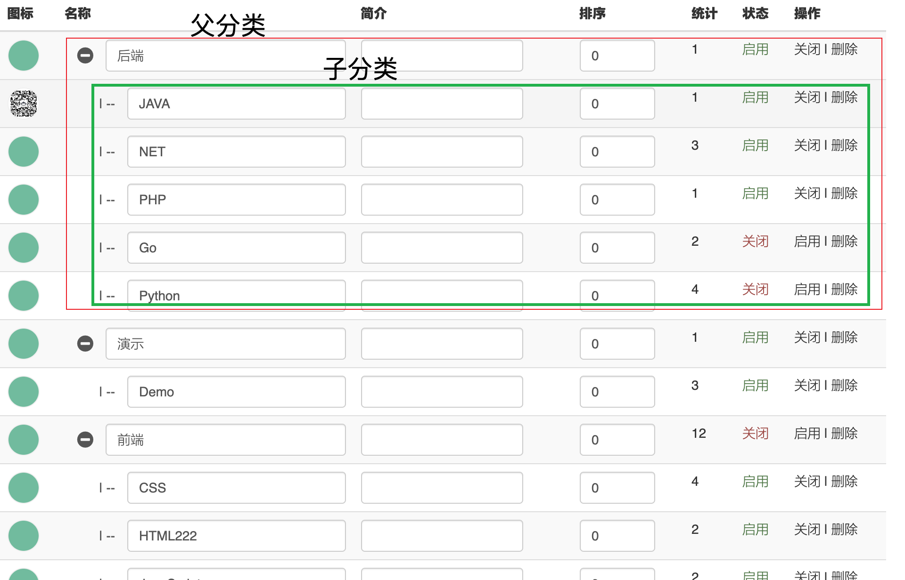
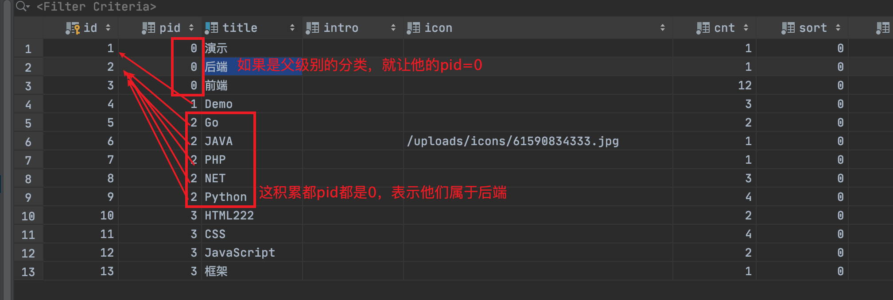
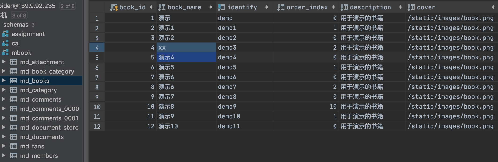
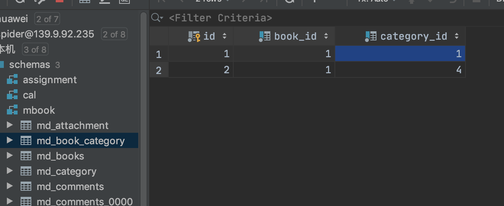
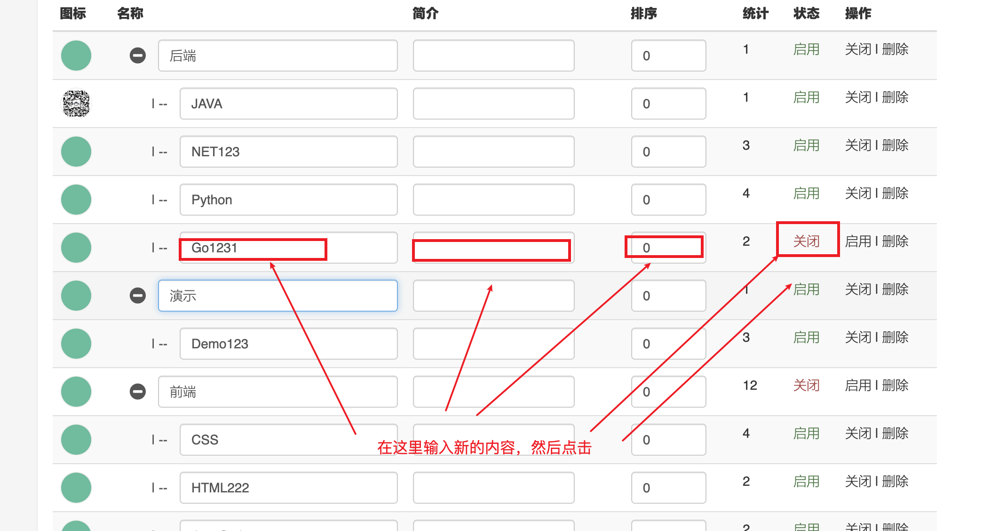
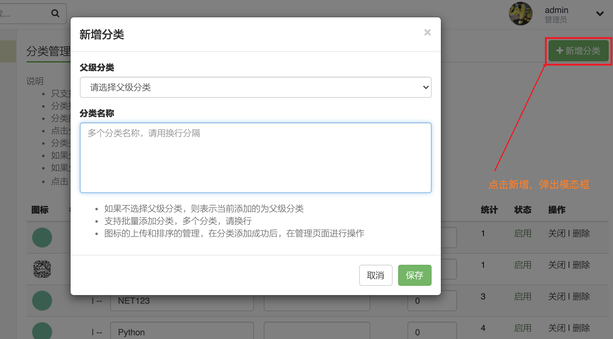

### 分类管理




这块功能是要实现对图书分类的管理，包括如下的：

* 进入到管理页面中数据的回显。
* 删除分类。
* 修改分类信息。
* 启用分类信息，禁用分类信息。
* 上传分类的图标。


#### 数据回显

首先看下上图中管理部分的前端代码如下：

```html
<ul class="menu">
    <li {{if .IsCategory}}class="active"{{end}}>
      <a href="{{urlfor "ManagerController.Category" }}" class="item">
        <i class="fa fa-th" aria-hidden="true"></i>
        分类管理
      </a> 
  	</li>
</ul>
```

做的效果就是点击分类按钮，往后端指定的controller中的Catagory方法上发送请求

通过下面这行router代码匹配到controller中

```go
beego.Router("/manager/category", &controllers.ManagerController{}, "post,get:Category")

// 参数1: path
// 参数2: Controller实例
// 参数3: controller中具体的哪个方法
beego.Router("/manager/caregory",&controllers.ManagerController{},"post,get:Category")
```

再看Controller中的具体实现：



比较惹人瞩目的地方：就是上面的Prepare方法，可以对照这个方法的实现，进一步理解继承在项目中的应用。


BaseController中作出的公共处理逻辑：




```go
//分类管理
func (c *ManagerController) Category() {
	cate := new(models.Category)

	// 如果是post则是新增
	// todo 这实际上是在处理异步请求
  // c.Ctx.Request.Method 是当前请求的请求方法
  // Controller的Context是个结构体，如下
  /*
  	type Context struct {
			Input          *BeegoInput
			Output         *BeegoOutput
			Request        *http.Request
			ResponseWriter *Response
			_xsrfToken     string
	}
  */
	if strings.ToLower(c.Ctx.Request.Method) == "post" {
		//新增分类
		pid, _ := c.GetInt("pid")
		if err := cate.InsertMulti(pid, c.GetString("cates")); err != nil {
			c.JsonResult(1, "新增失败："+err.Error())
		}
		c.JsonResult(0, "新增成功")
	}

	// 回显所的分类
	// todo 这是在处理同步请求，会导致浏览器的刷新
 	// 回显数据的话，肯定就是使用model层封装的方法把数据查出来
	// 查询所有分类
	cates, err := cate.GetCates(-1, -1)
	if err != nil {
		beego.Error(err)
	}
  
  // 下面这这段内容是在处理分类的信息，处理成前端需要的格式
	var parents []models.Category
	for idx, item := range cates {
    // 如果说icon字段为空的话，给他一个默认的图标
    // 静态资源统一放在 /static/目录下面
		if strings.TrimSpace(item.Icon) == "" {
			item.Icon = "/static/images/icon.png"
		} else {
      // 如果本身就有地址，就处理这一下图片的路径
			item.Icon = utils.ShowImg(item.Icon)
		}
    // 处理父分类信息
		if item.Pid == 0 {
			parents = append(parents, item)
		}
		cates[idx] = item
	}

	c.Data["Parents"] = parents
	c.Data["Cates"] = cates
	c.Data["IsCategory"] = true
	c.TplName = "manager/category.html"
}
```


看下，如何处理图片路径信息的

```go
// 操作图片显示
// 如果用的是oss存储，这style是avatar、cover可选项
func ShowImg(img string, style ...string) (url string) {
  // 如果开头是http或者是https，那说明图片路径通过网络直接可以访问，故直接返回就行
	if strings.HasPrefix(img, "https://") || strings.HasPrefix(img, "http://") {
		return img
	}
  // 将当前url中最左侧的./ 替换成 /
	img = "/" + strings.TrimLeft(img, "./")
	switch StoreType {
  // 阿里云的OOS。
	case StoreOss:
		s := ""
		if len(style) > 0 && strings.TrimSpace(style[0]) != "" {
			s = "/" + style[0]
		}
		url = strings.TrimRight(beego.AppConfig.String("oss::Domain"), "/ ") + img + s
	// 本地存储。
  case StoreLocal:
		url = img
	}
	fmt.Println(img)
	fmt.Println(url)
	return url
}
```


看到这里就是到数据是如何回显的，后端的处理逻辑是怎么的。

不妨在看看前端如何处理后端给的数据

根据指定的TPLNAME，找到模版`c.TplName = "manager/category.html"`




前端如下：主要还是在进行遍历

```go
       <table class="table table-hover table-striped">
                        <caption>说明
                            <ul>
                                <li>只支持二级分类</li>
                                <li>分类排序，值越小越靠前</li>
                                <li>分类的icon图标，宽高比为1:1，最小图片尺寸为50x50像素</li>
                                <li>点击分类图标可更换新图标</li>
                                <li>分类关闭之后，只是在前台起到隐藏作用</li>
                                <li>如果分类下的文档图书不为0，则该分类不能删除</li>
                                <li>如果分类下的文档图书为0，前端不显示该分类，但是用户在给文档图书设置分类时是能看到的</li>
                                <li>点击 <i class="fa fa-minus-circle"></i> 可以收起分类；点击 <i class="fa fa-plus-circle"></i> 可以展开分类</li>
                            </ul>
                        </caption>
                        <thead>
                        <tr>
                            <th>图标</th>
                            <th>名称</th>
                            <th>简介</th>
                            <th>排序</th>
                            <th>统计</th>
                            <th>状态</th>
                            <th>操作</th>
                        </tr>
                        </thead>
                        <tbody>
                        {{range $idx,$item:=.Cates}}
                            {{if eq $item.Pid 0}}
                            <tr>
                                <td>
                                    
                                </td>
                                <td>
                                    <div class="input-group">
                                        <span class="input-group-addon">
                                            <i class="fa fa-minus-circle" 
							data-id="{{$item.Id}}"
title="收起"></i>
                                            <i class="fa fa-plus-circle hide" data-id="{{$item.Id}}" title="展开"></i>
                                        </span>
                                        <input type="text" class="form-control change-update" name="title" data-url="{{urlfor "ManagerController.UpdateCate"}}?id={{$item.Id}}" value="{{$item.Title}}">
                                    </div>
                                </td>
                                <td>
                                    <div class="input-group">
                                        <input type="text" class="form-control change-update" name="intro" data-url="{{urlfor "ManagerController.UpdateCate"}}?id={{$item.Id}}" value="{{$item.Intro}}">
                                    </div>
                                </td>
                                <td>
                                    <div class="input-group">
                                        <input type="number" name="sort"  data-url="{{urlfor "ManagerController.UpdateCate"}}?id={{$item.Id}}" class="form-control change-update" value="{{$item.Sort}}">
                                    </div>
                                </td>
                                <td>{{$item.Cnt}}</td>
                                <td>
                                    {{if eq $item.Status true}}
                                        <span class="text-success">启用</span>
                                    {{else}}
                                        <span class="text-danger">关闭</span>
                                    {{end}}
                                </td>
                                <td>
                                    {{if eq $item.Status true}}
                                        <a href="{{urlfor "ManagerController.UpdateCate"}}?id={{$item.Id}}&field=status&value=0" class="ajax-get">关闭</a>
                                    {{else}}
                                        <a href="{{urlfor "ManagerController.UpdateCate"}}?id={{$item.Id}}&field=status&value=1" class="ajax-get">启用</a>
                                    {{end}}
                                    |
                                    <a  href="{{urlfor "ManagerController.DelCate"}}?id={{$item.Id}}" class="ajax-get confirm">删除</a>
                                </td>
                            </tr>
                                {{/*这部分是父分类下的自分类*/}}
                                {{range $idx2,$child:=$.Cates}}
                                        {{if eq $item.Id $child.Pid}}
                                        <tr class="cates-group-{{$item.Id}}">
                                            <td>
                                                
                                            </td>
                                            <td>
                                                <div class="input-group">
                                                    <span class="input-group-addon">&nbsp;&nbsp;&nbsp;&nbsp;&nbsp;&nbsp;| --</span>
                                                    <input type="text" name="title"  data-url="{{urlfor "ManagerController.UpdateCate"}}?id={{$child.Id}}" class="form-control change-update" value="{{$child.Title}}">
                                                </div>
                                            </td>
                                            <td>
                                                <div class="input-group">
                                                    <input type="text" class="form-control change-update" name="intro" data-url="{{urlfor "ManagerController.UpdateCate"}}?id={{$child.Id}}" value="{{$child.Intro}}">
                                                </div>
                                            </td>
                                            <td>
                                                <div class="input-group">
                                                    <input type="number" name="sort" class="form-control change-update" data-url="{{urlfor "ManagerController.UpdateCate"}}?id={{$child.Id}}" value="{{$child.Sort}}">
                                                </div>
                                            </td>
                                            <td>{{$child.Cnt}}</td>
                                            <td>
                                            {{if eq $child.Status true}}
                                                <span class="text-success">启用</span>
                                            {{else}}
                                                <span class="text-danger">关闭</span>
                                            {{end}}
                                            </td>
                                            <td>

                                            {{if eq $child.Status true}}
                                                <a href="{{urlfor "ManagerController.UpdateCate"}}?id={{$child.Id}}&field=status&value=0" class="ajax-get">关闭</a>
                                            {{else}}
                                                <a href="{{urlfor "ManagerController.UpdateCate"}}?id={{$child.Id}}&field=status&value=1" class="ajax-get">启用</a>
                                            {{end}}
                                                |
                                                <a href="{{urlfor "ManagerController.DelCate"}}?id={{$child.Id}}" class="ajax-get confirm">删除</a>
                                            </td>
                                        </tr>
                                        {{end}}
                                {{end}}
                            {{end}}

                        {{end}}
                        </tbody>
                    </table>
```


#### 树形的分类设计

看下这张图，就啥都明白了。




#### book表



图书下有专属的图表信息。


#### 书和分类之间的中间表

图书根类之间通过中间表建立关联




#### 删除分类信息

删除分类的信息肯定是根据分类的id去删除。

看看前端是如何拼接这个url的:

```html
<a href="{{urlfor "ManagerController.DelCate"}}?id={{$child.Id}}"
   class="ajax-get confirm">
  删除
</a>
```

通过a标签发起请求，在前后端不分离的情况下，**势必会导致页面的刷新**，看下后端是如何处理的

```go
//删除分类
// 先从请求中获取请求参数，再删除
func (c *ManagerController) DelCate() {
	var err error
	if id, _ := c.GetInt("id"); id > 0 {
		err = new(models.Category).Delete(id)
	}
	if err != nil {
		c.JsonResult(1, err.Error())
	}
  // 一开始嗨比较差异，前端通过a标签发送请求，但是把，你这里返回了json数据
  // 有没有搞错？
  // 实际上他的设计思路是这样的，a标签发送请求，页面整体刷新是板上钉钉子的事，虽然刷新页面震动，不过我的数据在页面加载的过程中url也没有变，肯定会重新向后端请求拉去到了最新的数据。
  // 怎么这里就先返回json???, 而且在前端跳转页面前还先回显了这段json
  // 答案在： main.js 中
	c.JsonResult(0, "删除成功")
}


// 发送的请求参数：  xxx?id=123
// 获取方式的话，是直接使用的beego的封装的方法
// GetInt returns input as an int or the default value while it's present and input is blank
func (c *Controller) GetInt(key string, def ...int) (int, error) {
	strv := c.Ctx.Input.Query(key)
	if len(strv) == 0 && len(def) > 0 {
		return def[0], nil
	}
	return strconv.Atoi(strv)
}


```


执行删除的操作如下：骚气十足

```go
//删除分类
func (m *Category) Delete(id int) (err error) {
	var cate = Category{Id: id}

	o := orm.NewOrm()
  // 骚气十足的查询，都不用先繁琐的获取到qs
	if err = o.Read(&cate); cate.Cnt > 0 { //当前分类下文档图书数量不为0，不允许删除
		return errors.New("删除失败，当前分类下的问下图书不为0，不允许删除")
	}
	// 删除
	// 第一个参数是md，间接告诉orm删除哪个表中的信息
	// 第二个参数是id，间接告诉orm根据当亲对象的什么属性去删除
	if _, err = o.Delete(&cate, "id"); err != nil {
		return
	}

	// 第二种删除的方式，手动根据表获取到qs，然后通过filter加条件实现删除哪条数据，在delete
	_, err = o.QueryTable(TNCategory()).Filter("pid", id).Delete()
	if err != nil { //删除分类图标
		return
	}
	return
}
```


main.js 很骚气，**又学了一招，先发ajax，请求结束后给用户友好提示

```js
    // 通过jquery为所有class中有ajax.get的元素绑定点击事件
		//ajax-get
    $(document).on("click",".ajax-get",function (e) {
        // 阻止了默认的页面跳转事件
        e.preventDefault();
        if($(this).hasClass("confirm") && !confirm("您确定要执行该操作吗？")){
            return true;
        }
        var _url=$(this).attr("href"),_this=$(this);
        // 发送ajax请求 
        $.get(_url,function (ret) {
            // 将json转换成对象 
            ret=parseJson(ret);
            if(ret.errcode==0){//操作成功
                // ui提示
                alertTips("success",ret.message,3000,location.href);
            }else{
                alertTips("danger",ret.message,3000,"");
            }
        })
    });

```


#### 修改分类信息




前端这种设计的话，其实也新颖的，前端的代码如下：

```html
{{if eq $child.Status true}}
     <a href="{{urlfor "ManagerController.UpdateCate"}}?id=				{{$child.Id}}&field=status&value=0"
               class="ajax-get">关闭</a>
{{else}}
     <a href="{{urlfor "ManagerController.UpdateCate"}}?id={{$child.Id}}&field=status&value=1" 
          		 class="ajax-get">启用</a>
{{end}}
```

设计的思路和上一个删除的思路是相同的，由于加了 ajax-get的属性，所以会被绑定上点击事件，得到后端的响应后发生，本质上他依然会阻止a标签跳转页面的行为，然后发送ajax请求，但是请求方式和url依然时候a标签的效果。

关闭和启用本质上由数据库中的一个字段控制的。

在前端为了区分启用还是关闭，通过请求参数中的value=1，还是value=0来实现。


下面去看后端的代码：

```go
//更新分类字段内容
func (c *ManagerController) UpdateCate() {
  // 获取请求中的请求参数
	field := c.GetString("field")
	val := c.GetString("value")
	id, _ := c.GetInt("id")
  // 创建model对象指针，根据对象指针更新字段
	if err := new(models.Category).UpdateField(id, field, val); err != nil {
		c.JsonResult(1, "更新失败："+err.Error())
	}
	c.JsonResult(0, "更新成功")
}
```

执行更新的函数如下：

```go
//更新分类字段
func (m *Category) UpdateField(id int, field, val string) (err error) {
  // 先获取到qs，然后为qs添加filter，再执行update语句
  // 这个update语句可以实现部分更新。
  // 入参是Params类型的变量。 他是orm.go中的一个map[string]interface{}
  // update会将匹配到的行的中的field列改成val值
	_, err = orm.NewOrm().QueryTable(TNCategory())
  										 .Filter("id", id)
  										 .Update(orm.Params{field: val})
	return
}
```


#### 新增分类信息



```html
 <div class="modal-content">
            <div class="modal-header">
                <button type="button" class="close" data-dismiss="modal" aria-label="Close"><span aria-hidden="true">&times;</span></button>
                <h4 class="modal-title" id="myModalLabel">新增分类</h4>
            </div>
            <div class="modal-body">
                <div class="form-group">
                    <label class="col-sm-12">父级分类</label>
                    <div class="col-sm-12">
                        <select name="pid" class="form-control">
                            <option value="0"> 请选择父级分类 </option>
                            {{range .Parents}}
                            <option value="{{.Id}}">{{.Title}}</option>
                            {{end}}
                        </select>
                    </div>
                </div>
                <div class="form-group">
                    <label class="col-sm-12">分类名称</label>
                    <div class="col-sm-12">
                        <textarea name="cates" id="cates" rows="5" class="form-control" placeholder="多个分类名称，请用换行分隔"></textarea>
                    </div>
                </div>
                <div class="help-block">
                    <ul>
                        <li>如果不选择父级分类，则表示当前添加的为父级分类</li>
                        <li>支持批量添加分类，多个分类，请换行</li>
                        <li>图标的上传和排序的管理，在分类添加成功后，在管理页面进行操作</li>
                    </ul>
                </div>
                <div class="clearfix"></div>
            </div>
            <div class="modal-footer">
                <span id="form-error-message"></span>
                <button type="button" 
                        class="btn btn-default" 
                        data-dismiss="modal">
                 			  取消
                </button>
                <button 
                        type="submit" 
                        class="btn btn-success" 
                        data-loading-text="保存中..." 
                        id="btnCreateCategory">
                  			保存
               </button>
            </div>
        </div>
        </form>
```

使用modal框实现的，父级分类从 .Parent 中遍历出来。

添加我们让用户先选择父级分类，再填写子分类。

点击保存将用户的数据发送到后端：

前端发送到请求依然是 ajax请求。前端的代码如下：


设计的还是挺好的，是个公共方法：

```go
    //ajax-form
    $(".ajax-form [type=submit]").click(function(e){
        // 	阻止form表单的默认事件
        e.preventDefault();
      	//  通过jquery的选择器，this对象是当前用户点击的对象（按钮）
        var _this=$(this),
      			// 获取当前对象的父对象，form表单
      	 		 form=$(this).parents("form"),
      			 method=form.attr("method"),
      			 action=form.attr("action"),
      			 data=form.serialize(),
     	      _url=form.attr("data-url");
        //  获取到表单中的必填项
        var require=form.find("[required=required]"),
      				    l=require.length;
      	// 检查必填项中是否全部填写了 
        $.each(require, function() {
            if (!$(this).val()){
                $(this).focus();
                return false;
            }else{
                l--;
            }
        });
      	
        if (!_url || _url==undefined){
            _url=location.href;
        }
        if (l>0) return false;
      
        // 发送不同的ajax请求
        if (method=="post") {
          	// 这里就牵扯出来了另一个知识
          	// 表单中的 enctype 属性
          	//一. 如果是 text/plain： 用纯文本的形式发送。
          	//二. application/x-www-form-urlencoded ： 这也是默认的形式，会将表单中的数据编码进url中
          	//	1、表单中的enctype值如果不设置，则默认是application/x-www-form-urlencoded，它会将表							单中的数据变为键值对的形式。
						//	2、如果action为get，则将表单数据编码为(name1=value1&name2=value2…)，然后把这个字符串							 加到url后面，中间用?分隔
					  //  3、如果action为post，浏览器把form数据封装到http body中，然后发送到服务器。
          	//三. 如果是mutipart/form-data类型的参数，说明我们上传的是非文本内容，比如是个图片，文件，mp3
            if (form.attr("enctype")=="multipart/form-data"){
                form.attr("target","notarget");
                form.submit();
            }else{
                $.post(action,data,function(ret){
                    ret=parseJson(ret);
                    if (ret.errcode==0) {
                        alertTips("success",ret.message,2000,_url);
                    } else{
                        alertTips("error",ret.message,3000,"");
                    }
                });
                _this.removeClass("disabled");
            }
				// 
        } else{
            $.get(action,data,function(ret){
                ret=parseJson(ret);
                if (ret.errcode==0) {
                    alertTips("success",ret.message,2000,_url);
                } else{
                    alertTips("error",ret.message,3000,"");
                }
            });
        }
    });
```


当然我们这就使用默认的格式：post + application/x-www-form-urlencoded

后端的相关逻辑：

```go
	if strings.ToLower(c.Ctx.Request.Method) == "post" {
		// 新增分类,从请求参数获取 父id
		pid, _ := c.GetInt("pid")
    // 
		if err := cate.InsertMulti(pid, c.GetString("cates")); err != nil {
			c.JsonResult(1, "新增失败："+err.Error())
		}
		c.JsonResult(0, "新增成功")
	}

```

进一步看看InsetMuti函数

```go
//批量新增分类
func (m *Category) InsertMulti(pid int, cates string) (err error) {
	// 当时要求前端用换行分割，我们后端也用换行拆分各个子分类
	slice := strings.Split(cates, "\n")
	if len(slice) == 0 {
		return
	}

	o := orm.NewOrm()
  // 所谓批量新增分类其实指的是这个for循环中批量新增。
	for _, item := range slice {
		if item = strings.TrimSpace(item); item != "" {
			var cate = Category{
				Pid:    pid,
				Title:  item,
				Status: true,
			}
			// 做了一步校验，title不存在我们才上传
			// todo o.Read(&cates)根据当前cates中的所有字段去查询
			// todo o.Read(&cates，"title")根据当前cates中的title字段去查询
			if o.Read(&cate, "title"); cate.Id == 0 {
				_, err = o.Insert(&cate)
			}
		}
	}
	return
}
```


