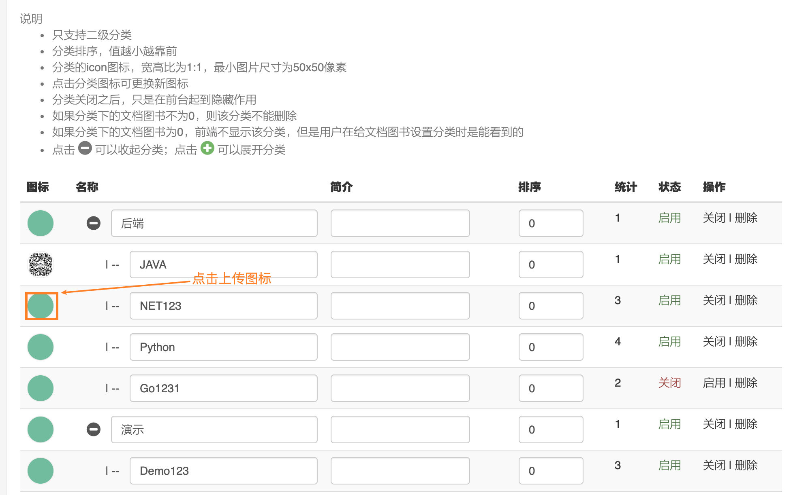
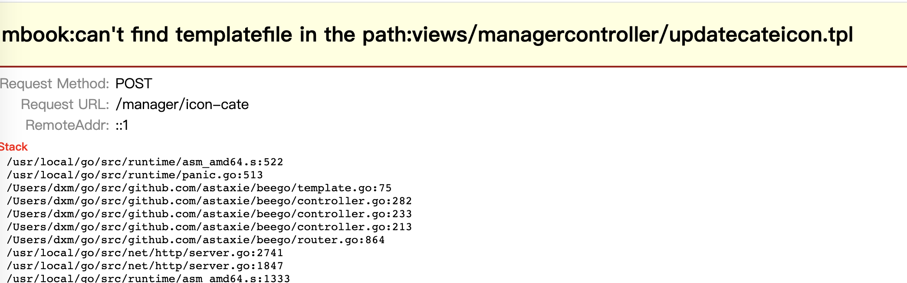
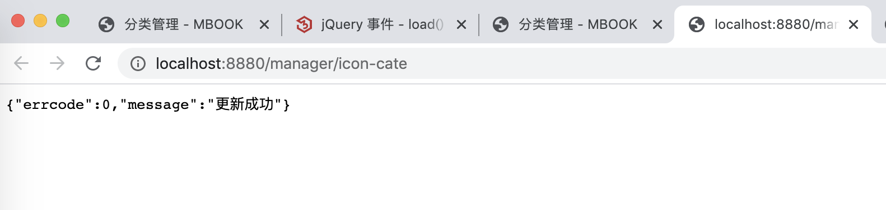
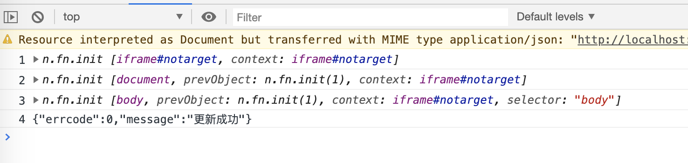

### 上传图片

这个业务需求是在分类管理中为各个分类上传icon




先看前端的代码：

```html
    <td>
         
    </td>
```

**在前端的实现思路：通过jquery为img绑定点击事件，一旦用户点击后，触发相关的回调，剩下的操作全部由js控制。通过jquery获取dom中form，由js触发点击文件上传html，并由js完成表单的提交**

下面是js为当前image绑定点击事件的逻辑：

```js
   //更换分类的图标
    $(".category-manager .icon-category-small").click(function () {
        // todo 通过jquery的选择器，获取到class为cate-icon-form的表单
        var form=$("form.cate-icon-form");
        // todo 通过attr属性，获取到分类的name = id的dom, 通过val为其填充值
        form.find("[name=id]").val($(this).attr("data-id"));
        // todo 通过attr属性，获取到分类的name = icon的dom, 触发他的点击事件，点击事件触发后，浏览器会打开弹窗，提示选择文件
        form.find("[name=icon]").trigger("click");
    })
```


上传图片相关的formhtml如下：

```js
{{/*更新图标*/}}
<form style="display: none;" 
		  action="{{urlfor "ManagerController.UpdateCateIcon"}}" 
			target="notarget" 
			method="post"
			class="cate-icon-form" 
			// 注意他的类型，标记了这个form将提交文件/图片
			// 这个标记是给先前看过的那个公共的发情ajax请求的js函数判断的
			// 如果类型multipart/form-data，执行的逻辑不是发送异步请求，而是 form.submit()
			enctype="multipart/form-data">
        
    <input type="text" name="id" value="">
    <input type="file" accept="image/jpeg,image/jpg,image/png,image/gif" 
					 id="cate-icon" name="icon">
</form>
```

当然这是个form表单，直接点击submit会导致这个表达的提交，附带作用就是导致页面的刷新颤动。

但是在项目中这个过程被js打断了。

如下：

```js
  // todo 用户选择的文件后点击确认，jquery就会为id为cate-icon的dom元素的触发change()函数
    $("#cate-icon").change(function () {
        if ($(this).val() != "") {
            // todo 完成表单的提交，实际上传完成上传了
            // jquery的submit()函数会导致表单提交！！！
            // jquery的submit(fun) 不会导致表单的提交，而是绑定表单提交时的处理函数。
            $("form.cate-icon-form").submit();
        }
    });
```

**在这种前后端不分离的项目中，表单提交后是会发生页面的重新加载的，也就是说页面会出现一次震动**

**具体的动作其实后端是可以控制的，比如后端可以让前端发起个重定向，跳转到别的页面。**

**也可以重新来到这个页面并携带有错误信息回显给用户查看。**

**后端也可以不做任何处理，即：既不指定tpl，也不返回json，那么前端会收到这样的报错：**




**前端也是可以进行一些控制的：比如前端是可以通过target控制在新的页面打开后端的结果，还是使用当前页面显示当后端显示的结果**

比如 target=“_bank” 是在新的页面中打开

比如 target=“_self”   是在当前的页面中打开

---

再去看后端的代码逻辑：如何处理用户提交的

```go
//更新分类的图标
func (c *ManagerController) UpdateCateIcon() {
	var err error
	// 获取id，为这个id对应的数据添加分类图标
	id, _ := c.GetInt("id")
	if id == 0 {
		c.JsonResult(1, "参数不正确")
	}
	// 创建分类对象
	category := new(models.Category)
	// 校验id对应的数据是否存在
	if cate := category.Find(id); cate.Id > 0 {
		// 处理当前分类的 Icon， 去掉最左侧的 /
		cate.Icon = strings.TrimLeft(cate.Icon, "/")
		// 根据名称，从controller中获取到用户上传的文件
		f, h, err1 := c.GetFile("icon")
		if err1 != nil {
			err = err1
		}
		defer f.Close() // 拿到这个文件后，别忘了关闭文件
		// filepath.Ext("123.png") 可以获取到拓展名
		// 拼接字符串  uploads/icons/id时间戳.png == uploads/icons/61590912609.jpg
		tmpFile := fmt.Sprintf("uploads/icons/%v%v"+filepath.Ext(h.Filename), id, time.Now().Unix())
		// filepath.Dir()函数可以返回一个完成文件路径中的dir  
    // uploads/icons/61590912609.jpg  =》 uploads/icons
		// 调用系统的函数，创建dir
		os.MkdirAll(filepath.Dir(tmpFile), os.ModePerm)

		// 调用beegoControoler中的方法，可以将form中上传的文件，保存进我们指定的这个新的目录中
		if err = c.SaveToFile("icon", tmpFile); err == nil {
      
			// 删除当前cate中的icon在本地的图片
			store.DeleteLocalFiles(cate.Icon)

			// 更新数据库中icon这个字段，更新成最新的
			err = category.UpdateField(cate.Id, "icon", "/"+tmpFile)
		}
	}

	// 返给前端json
	if err != nil {
		c.JsonResult(1, err.Error())
	}
	c.JsonResult(0, "更新成功")
}
```


后端是返回给前端json信息的，如果前端将target=“_self” ， 那么回显的结果如下：

回显的json会冲掉浏览器中的现有的html内容




**本项目中高明的地方是如下： 它将target设置成 notarget， 这样就不在任何一个新的视图去打开这个项目**

```html
<form style="display: none;" action="{{urlfor "ManagerController.UpdateCateIcon"}}" 
      target="notarget" 
      method="post" 
      class="cate-icon-form" enctype="multipart/form-data">
    <input type="text" name="id" value="">
    <input type="file" accept="image/jpeg,image/jpg,image/png,image/gif" id="cate-icon" name="icon">
</form>

```

**不在任何一个新的视图中打开新的项目也就意味着，当前页面中内容肯定不会被冲掉**

具体的js代码如下：

```js
    //todo 上传结束了我们更新图片的url，让用户看到最新的图片
    $("#notarget").load(function () {
        console.log("1",$(this))
        console.log("2",$(this).contents())
        console.log("3",$(this).contents().find('body'))
        console.log("4",$(this).contents().find('body').text())
      
       var obj = JSON.parse($(this).contents().find('body').text());
      
       // 判断
       if (obj.errcode == 0) {
            alertTips("success", "上传成功", 2000, "");
            setTimeout(function () {
                // 重新加载当前页面
                location.reload();
            }, 1500);
        } else {
            alertTips("danger", obj.message, 3000, "");
        }
      
        $(".btn-upload-zip").removeClass("disabled");
      
    });
```


如上的四个console打印结果入下：

分别是： iframe，document，body，json信息




